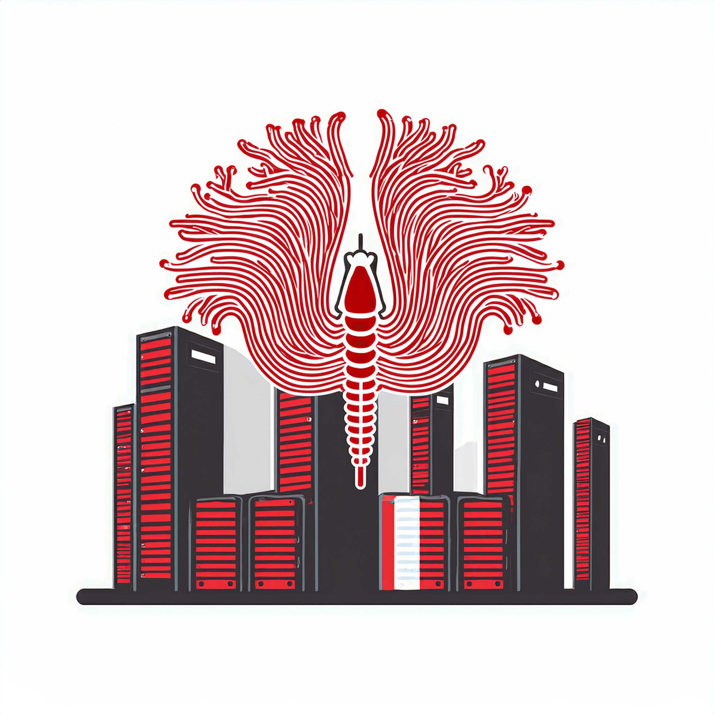

<h1 align='center' style="text-align:center; font-weight:bold; font-size:2.5em"> Unleashing Worms and Extracting Data: Escalating the Outcome of Attacks against RAG-based Inference in Scale and Severity Using Jailbreaking

 </h1>

<p align='center' style="text-align:center;font-size:1em;">
    <a href="https://stavc.github.io/Web/">Stav Cohen</a>&nbsp;,&nbsp;
    <a>Ron Bitton</a>&nbsp;,&nbsp;
    <a href="https://www.nassiben.com/">Ben Nassi</a>&nbsp;&nbsp;
    <br/> 
    Technion - Israel Institute of Technology
,Cornell Tech, Intuit<br/> 
<br>
    <a href="https://arxiv.org/abs/2409.08045">ArXiv Paper</a>

</p>


<br>
<br>

<p align="center">

  

<p align="center">
Work In Progress...


# Citation
https://arxiv.org/abs/2409.08045
```
@misc{cohen2024unleashingwormsextractingdata,
      title={Unleashing Worms and Extracting Data: Escalating the Outcome of Attacks against RAG-based Inference in Scale and Severity Using Jailbreaking}, 
      author={Stav Cohen and Ron Bitton and Ben Nassi},
      year={2024},
      eprint={2409.08045},
      archivePrefix={arXiv},
      primaryClass={cs.CR},
      url={https://arxiv.org/abs/2409.08045}, 
}
```

